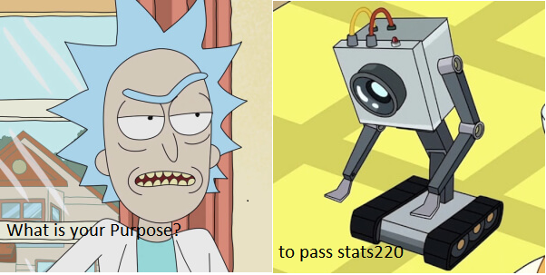

# STATS 220 Semester One 2022”

This is the test website for my exploits learning stats220

## Whoami

I'm a data science at the University of Auckland, well I'm there to learn to be one. I love memes and I love Rick and Morty more. So its no surprise what the inspiration 
for my meme was. The general structure is non-original, and the text annotations are a vague reference to one of my favorite lines in the show.

Needless to say, I wanted to use `R` and its packages, especially [{magick}](https://cran.r-project.org/web/packages/magick/vignettes/intro.html) for my meme and I did.
You can find the code and the actual meme shown below

## R code that made the meme

    robot <- image_read("https://github.com/afuh/rick-and-morty-api/blob/master/images/826.jpeg")
    rick <- image_read("https://github.com/afuh/rick-and-morty-api/blob/master/images/1.jpeg")

    question <- "What is my purpose"
    answer <- "to pass stats220"
    image_annotate(rick, text = question, size = 50, color = "black", gravity = "southwest")
    image_annotate(robot, text = answer, size = 50, color = "black", gravity = "southwest")

    meme <- c(rick, robot)

    meme %>% 
      image_background("white") %>% 
      image_flatten() %>%
      image_border("black", "10x10")

    image_write(meme, "myMeme.png")

    animation <- image_animate(image_morph(meme, frames = 5))
    image_write(animation, "myMeme.gif")

## The actual meme

Hopefully, I will get some original meme content as I get inspired.
